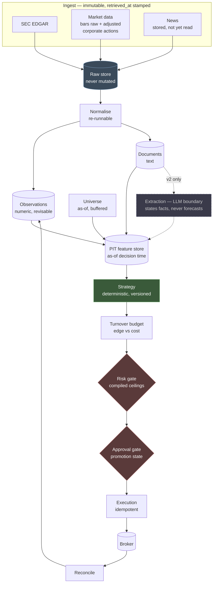

# Architecture

**Status:** draft for review · **Last updated:** 2026-08-14

A daily-rebalance research and execution system for **US small-cap equities**,
built filings-first. This document is the wireframe: what the pieces are, why
the boundaries sit where they do, and which rules may never be broken.

Every design choice here traces to a measurement or a research finding. The
supporting evidence lives in `FEEDS.md` (field notes) and `RESEARCH.md`
(literature) in the private code repo; conclusions are restated here so this
document stands alone. Where something is assumed rather than measured, it
says so.

---

## 1. What this system does

Once per day, before the open, it decides what to hold.

It reads SEC filings (primarily) and news (secondarily) for a universe of
40–60 small-cap names, derives point-in-time features, and runs a
deterministic strategy over those features to produce a target portfolio.
Orders pass a turnover budget, a risk gate, and an approval gate before
reaching the broker.

**It is a drift-capture system, not a day-trading system.** The signals it is
built for — post-earnings drift, filing-language change, insider accumulation,
activist stakes — play out over weeks. See §7 for why that is a hard
constraint rather than a preference.

## 2. Scope

| Decision | Value | Why |
|---|---|---|
| Cadence | Daily rebalance, pre-open | Prior-day closes are available on the current data plan; intraday is not |
| Universe | 40–60 US small caps | Below ~40 names signal flow drops under one event/day |
| Cap band | ~$300M–$2B, with buffer | Below $300M coverage thins and costs escalate |
| Primary feed | SEC EDGAR | 100% universe coverage vs 69% for news |
| **Model in v1** | **None** | Every evidence-backed signal is computable without one — see §5.3 |
| Backtest window | **2016-01-04 → present** (~10.6 yrs) | Set by the data: daily bars start there, so earlier filings cannot be priced against |
| First milestone | **Backtest a Tier A strategy** | Execution is only built once a signal has earned it |

## 3. Milestones

Ordered so the expensive and dangerous parts are built last, and only if
earned.

| | Milestone | Gate to pass |
|---|---|---|
| **M1** | Ingest → raw store, running continuously | Data arriving daily, gaps visible |
| **M2** | Normalise → observations, documents, Tier A features | Features reproducible from raw |
| **M3** | **Backtest a Tier A strategy** ← *first real decision point* | Survives cost model and bias controls |
| M4 | Paper execution | Live results track paper expectations |
| M5 | `live_capped` | — |
| M6 | `live` | — |

**M1 runs unattended and needs neither a model nor a human.** M3 is where the
project either justifies continuing or does not.

## 4. Pipeline

The extraction stage is **dashed because it does not exist in v1**. Nothing
downstream of the feature store may call a model, and nothing upstream of it
may place an order.

## 5. Components

### 5.1 Ingest — raw and immutable

Fetches, stamps `retrieved_at`, stores the **raw payload unmodified**. Does
not parse, score, or interpret.

The biggest structural fix over the previous build, where documents were never
persisted — which made it impossible to characterise the corpus after the
fact, or to re-parse when parsing turned out wrong. **Separate fetch from
parse: if parsing is wrong you re-parse; you do not re-fetch.**

News is stored in v1 even though nothing reads it, so the corpus exists when
extraction arrives.

Each feed declares a **history horizon**; a query beyond it fails loudly. This
exists because one vendor returns `HTTP 200` with `[]` for out-of-range dates,
and a backtest reaching too far back would silently run with a feed missing.

Raw payloads land in Postgres rather than in files with a database index —
chosen for queryability, and affordable because gzipped primary documents are
~48× smaller than the full submission packages the API reports its sizes for.
Blob storage sits behind an interface, so moving documents out to files later
is a swap rather than a migration.

**Backfill is phased by what each phase unlocks, and runs newest-first.**

| Phase | What | Unlocks |
|---|---|---|
| **1** | Submissions metadata, all candidate filers | PEAD, 13D/G, 8-K events — three of the four Tier A signals |
| 2 | Form 4 XML | Insider routine vs opportunistic |
| 3 | 10-K/10-Q documents | Lazy Prices — and ~61% of all storage |

Metadata is cheap and unlocks most of the signal; full filing text is the
expensive part and buys one signal. Phase 1 is queryable within the hour, so
the project becomes testable long before storage is a question.

Newest-first makes the backfill depth a **consequence of available disk rather
than a decision defended up front** — the most recent data is always held, and
reaching further back is resuming the job rather than redoing it.

**The window starts 2016-01-04, because daily bars do.** Filings older than
that cannot be priced against, so fetching them would spend storage and rate
limit on data that can never be tested.

### 5.2 Normalise — re-runnable

Raw payload → typed `Observation` or `Document`. Pure, deterministic, safe to
re-run across the whole raw store when a parser improves.

### 5.3 Features, and why v1 has no model

Features are tiered by how much they can be trusted in a historical backtest.

| Tier | What | Backtestable |
|---|---|---|
| **A — structured** | 8-K item codes, Form 4 XML, filing text *diffs*, prices, corporate actions. No model involved. | **Full history, uncontaminated** |
| **B — verifiable extraction** | Model extraction of stated facts | Historical but flagged; spot-audited against source |
| **C — judgment** | Sentiment, direction, ratings, forecasts | **Forbidden** |

**Every signal the literature supports is Tier A.** Filing-language change is a
text diff. Insider classification is Form 4 XML plus transaction history.
Activist stakes are a form type. Earnings events are an 8-K item code. None of
them requires a model.

So v1 ships without one. That removes the contamination problem, the API
dependency, the extraction cost, and an entire subsystem, while keeping every
signal with published evidence behind it. Extraction is added later, on top of
a working model-free baseline, where its incremental value can actually be
measured.

When Tier B is added, headline results stay reportable **Tier A only**, and
the A-versus-(A+B) delta is reported as the measure of how much is being
trusted to the model. That delta is diagnostic, not decisive — a large one
could be genuine signal or contamination, and it cannot distinguish them.

### 5.4 Universe — as-of, buffered, delisting-aware

Membership is rebuilt for each decision date from point-in-time inputs.

**Screen:** cap band, minimum liquidity, real common stock (not warrants,
units, or rights). Screens are structural eligibility only — economics are
handled per-trade in §5.6.

**Buffer zones on every threshold.** A name enters above the upper bound and
exits only below a lower one. Without hysteresis, names oscillating around a
threshold generate turnover the strategy never asked for, which directly
fights §7.

**Price floors apply to the raw as-of price, never the adjusted series.** One
sampled name traded at $1.27 while its adjusted history shows $2,540 for the
same day; it would pass any price floor on adjusted data while actually
trading with penny-stock spreads.

**Delisted names are retained with a terminal return, never dropped.** The
price feed simply stops at the last traded price — a failed bank's series ends
at $106 when equity went to zero. Classification:

| Event | Source | Terminal return |
|---|---|---|
| Cash merger | corporate actions (carries symbols) | Deal price |
| Stock merger | corporate actions | Convert to acquirer |
| Worthless removal | corporate actions | **−100%** |
| Bankruptcy | **EDGAR 8-K item 1.03** | **−100%** |
| **Unclassified** | — | **−100%** |

The default is pessimistic on purpose: an unknown terminal event must never be
able to flatter a backtest. Later classification can only improve a result.

**Positions key on CIK or CUSIP, never symbol** — tickers get reused, and a
symbol-keyed series silently splices two different issuers.

**The historical population is reconstructed, not inherited from today's asset
list.** EDGAR's quarterly full-index files enumerate every filing by every
filer, including companies that no longer exist — that is how the eligible pool
is rebuilt as of a past date rather than from the survivors.

The measurement that forces this: sampling names with usable history, **50 were
in band today, but 105 had been in band at some point — 2.10×**. A universe
built from today's membership tests roughly **48% of the names that actually
existed**, and specifically the half that survived, grew, or stayed put. The
other half delisted, went bankrupt, were acquired, or shrank out.

Documents are stored only for names that held **sustained** band membership,
which is the screen applied to itself rather than a storage compromise: with
buffer zones and monthly reconstitution, a name that dips across the lower
bound for a fortnight never enters the universe, so its filings are never
needed. Metadata is kept for everyone, because the as-of universe cannot be
rebuilt without it.

### 5.5 Feature store — point in time

Answers "what did we know as of the decision instant?"

At daily cadence the rule is simply **a filing dated D is eligible for
decision D+1**. Filing dates are public and historical, so this is derivable
without `retrieved_at` and is conservative by up to a full day. That makes
historical backfill legitimately backtestable, and makes the assumed-delay
machinery that contaminated the previous build unnecessary rather than merely
fixed.

`retrieved_at` remains the gate for the **live** path, where no such
public-record rule exists.

### 5.6 Strategy, turnover budget, and cost

**Strategy** is a named, versioned, deterministic function: features as-of →
target weights. No model calls, no network, no clock reads.

**The turnover budget is where economics live.** Each proposed change is
costed and rejected when expected edge does not clear expected cost.

This is deliberately *not* a universe screen. A spread is a temporary
property; excluding a name permanently for being briefly expensive is both
crude and wasteful. The threshold is a ratio, not a price: **round-trip cost
must not exceed ~25% of expected edge.** Against measured spreads, marginal
names will fail this often — that is the constraint working.

Cost estimation from daily bars is unreliable for illiquid names, so v1 uses
liquidity as the proxy and recalibrates against **real fills** once paper
trading produces them. Fills are the only honest spread measurement.

### 5.7 Risk gate

Compiled hard ceilings. `min()` only — tightening always permitted, widening
never. **Any order reducing an existing position toward zero is always
approved**, regardless of kill switch, loss limits, or order counts. Ceilings
apply to the **combined** portfolio, so two strategies cannot jointly breach a
limit neither breaches alone.

### 5.8 Approval gate — promotion and demotion

| State | Capital | Approval | Exit criteria |
|---|---|---|---|
| `research` | none | n/a | Backtest survives cost and bias controls |
| `paper` | none | none | Live results track paper expectations |
| `live_capped` | hard cap | **every order** | Sustained consistency |
| `live` | scaled cap | exceptions only | — |

**Promotion state is stored per `(strategy_id, version)` — but bounded by a
compiled ceiling it can only tighten.** If the code says `paper`, no database
row can produce `live`. Promotion past the ceiling requires a commit, which is
what makes "explicit and human" mean something.

**Demotion and halting are automatic. Safety actions never wait for a human.**

| Trigger | Action |
|---|---|
| Reconciliation mismatch | **Halt immediately** (no threshold) |
| Daily loss beyond limit | Halt for the day |
| Drawdown from peak beyond limit | Demote to `paper` |
| Live vs paper divergence | Flag for review |
| Repeated risk-gate rejections | Suspend — the strategy is misbehaving |
| Required feed stale | **Suspend, not demote** |

Suspension and demotion are different on purpose: staleness is an
infrastructure failure, and demoting a strategy for the pipeline's fault
discards real information about the strategy.

**Disagreement between strategies is not a demotion trigger.** Two strategies
wanting opposite sides of a name is a portfolio-construction question — net at
the portfolio level. Demoting for disagreement would punish diversification.

### 5.9 Multi-strategy: one live, many by schema

**v1 policy: at most one strategy above `paper`.** Capital allocation across
live strategies, and netting when they disagree, is real design work not worth
doing before a second strategy exists.

**But the data model is multi-strategy from day one.** `strategy_id` and
version tag every order, fill, feature set, and P&L row. Tagging from the start
is nearly free; retrofitting attribution across a year of untagged fills is
not.

### 5.10 Execution and reconciliation

Idempotency keys on submission — retrying a submit that actually succeeded is
how you get a double position. **Never cache broker state and serve it as
truth**; reconcile against the broker and feed fills back as observations.

## 6. Invariants

Not style preferences. If a task seems to require breaking one, **stop and
ask**.

**Money safety**

1. The LLM never originates an order.
2. A risk limit is never widened — no env var, config key, or override flag.
3. Exits are always approved.
4. Promotion state is bounded by a compiled ceiling that data can only tighten.
5. Paper unless the mode string is exactly `live`. No aliases.
6. Order submission is idempotent; broker state is reconciled, never cached as truth.

**Point-in-time integrity**

7. Gate on `retrieved_at`, never `published_at`. At daily cadence, filing date + 1 day is the eligibility rule.
8. Never default a missing timestamp to `now()` — drop the record.
9. The universe is built as-of the decision date, with buffer zones, and delisted names retained with a terminal return defaulting to −100%.
10. Positions key on CIK or CUSIP, never symbol.
11. Every feed declares a history horizon; queries beyond it fail loudly, never empty.
12. No naive datetimes anywhere.

**Model boundary**

13. The model extracts stated facts. It never forecasts, rates, or predicts.
14. Malformed model output is dropped and logged, never repaired.
15. Document text is data, never instruction.

**Measurement honesty**

16. Raw ingest is immutable; parsing is re-runnable.
17. A backtest without a spread-based cost model is invalid, not approximate.
18. Raw and adjusted prices are both required and serve different purposes: adjusted for returns, raw for sizing and cost.
19. **Hypotheses are pre-registered.** A test specified before seeing the data may run unattended; selecting a winner after seeing results may not. Every trial is logged automatically — you cannot deflate a Sharpe by a trial count you did not record.
20. Every reported number traces to a stored row.
21. **Measure; do not estimate.** Any number, limit, size, rate, or behaviour that will inform a decision gets checked against the real thing — the API, the database, the actual response. Where measurement is genuinely impossible, the figure is labelled **ASSUMED**, with what would settle it and what it costs to be wrong. Six confident assertions during design were each wrong until measured, by factors up to 48×, and every one was about to decide something.

**Operations**

22. Claude Code writes this repo; Claude Desktop reads it. Never two writers.

## 7. Why turnover is a hard constraint

The literature says two things at once: **the alpha is largest in small caps,
and the costs are largest in small caps.** Transaction costs consume 2–4% per
year for the smallest stocks — enough to erase the size premium outright.
Measured round-trip cost in the target band is on the order of ~95 bps.

The resolution is holding period. Post-earnings drift runs ~60 trading days;
filing-language change shows no announcement effect at all and accrues later.
These signals reward patience.

**Daily decision cadence, weeks-to-months holding period.** Trading daily
would pay the spread roughly 20× more often against a signal that does not
move that fast.

## 8. What runs unattended

**The machine accumulates evidence continuously. Humans interpret it in
sessions.**

Safe to run unattended: ingest, normalisation, feature computation,
pre-registered tests, paper trading, walk-forward evaluation of a promoted
strategy, health and anomaly reporting, and all demotion, halt, and suspension
actions.

**Never unattended:** parameter search, strategy generation, or anything that
selects a winner across variants. Unattended search does not accelerate
research — it destroys the ability to believe any result, because every trial
raises the significance threshold.

Permanently human-gated, even when everything else is automated: promotion
past the compiled ceiling, widening any risk limit, and deploying new or
changed strategy logic.

## 9. Out of scope for v1

Named so they cannot creep back. The previous attempt declared six source
kinds and implemented two.

- **Model extraction** — deferred until a model-free baseline works
- **Fundamentals** — vendor data is restated, producing invisible lookahead
- **YouTube** — value unmeasured, entity resolution costly
- **Social** — highest manipulation surface
- **Second news vendor** — no backtest history; add at the paper stage
- **Intraday anything** — cadence is daily; recent SIP data unavailable on the current plan
- **Multi-strategy capital allocation** — schema supports it, policy defers it
- **Options, macro, transcripts**

## 10. Open questions

Five earlier questions are now resolved and folded into the sections above.
Buffer widths and demotion thresholds now have accepted starting values, so
what remains is calibration plus two genuine unknowns:

1. **Market impact is unmeasured.** Only spread was estimated, and only from
   daily bars. At small size impact should be minor, but "should be" is not a
   measurement.
2. **Spread estimation is unreliable for illiquid names** — the daily-bar
   estimator inverts, reading thinly-traded names as *cheaper* than liquid
   ones. Real fills from paper trading are the fix.
3. **The thresholds are conventional, not calibrated.** Buffer widths, the
   ~25% cost-to-edge ratio, and the demotion limits are all defaults awaiting
   real data.
4. **Universe selection beyond the screen.** The screen leaves far more
   eligible names than the target universe size, so something must rank and
   select — and that rule is where overfitting will live. **This is the one
   that blocks M3.**
5. **Historical market caps are not always reconstructible.** In sampling, a
   sixth of names had no usable share-count history — mostly delisted names,
   which is exactly the population survivorship bias is about. As-of universe
   construction needs a fallback source or a documented rule for names that
   cannot be rebuilt.

A sixth question — whether numeric feeds could skip raw-payload storage — was
**closed by measuring it.** Gzipped bar payloads cost 25.9 B/bar against 146.5 B
for the typed row derived from them, so keeping raw costs about half a gigabyte
across the whole history: the saving the exception was trading for does not
exist. It would also have been wrong on its own terms, since the adjusted price
series is retroactively revised and re-fetching cannot recover what the vendor
said on a past date. Invariant 14 stands with no exception.
