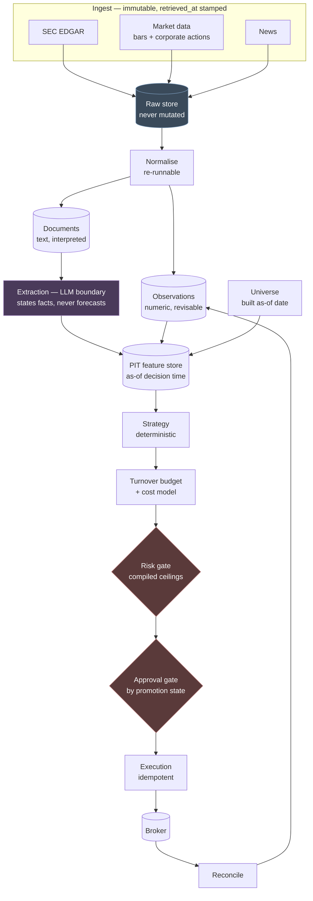

# Architecture

**Status:** draft for review · **Last updated:** 2026-08-13

A daily-rebalance research and execution system for **US small-cap equities**,
built filings-first. This document is the wireframe: what the pieces are, why
the boundaries sit where they do, and which rules may never be broken.

Every design choice here traces to a measurement or a research finding. The
supporting evidence lives in `FEEDS.md` (field notes) and `RESEARCH.md`
(literature) in the private code repo; the conclusions are restated here so
this document stands alone. Where something is assumed rather than measured,
it says so.

---

## 1. What this system does

Once per day, before the open, it decides what to hold.

It reads SEC filings (primarily) and news (secondarily) for a universe of
40–60 small-cap names, extracts **stated facts** from those documents, turns
them into point-in-time features, and runs a deterministic strategy over those
features to produce a target portfolio. Orders pass a risk gate and a human
approval gate before reaching the broker.

**It is a drift-capture system, not a day-trading system.** The signals it is
built for — post-earnings drift, filing-language change, insider accumulation —
play out over weeks. See §7 for why that is a hard constraint rather than a
preference.

## 2. Scope

| Decision | Value | Why |
|---|---|---|
| Cadence | Daily rebalance, pre-open | Prior-day closes are available on the current data plan; intraday is not |
| Universe | 40–60 US small caps | Below ~40 names the signal flow drops under one event/day |
| Cap range | ~$300M–$2B to start | Below $300M coverage thins and costs escalate |
| Primary feed | SEC EDGAR | 100% universe coverage vs 69% for news |
| Model role | Extraction only | Parametric look-ahead makes forecasting unsafe |
| First milestone | Research + backtest | Nothing goes live without forward-collected data |

## 3. Pipeline

**The model sits in exactly one box.** Nothing downstream of the feature store
may call a model, and nothing upstream of it may place an order.

## 4. The two input shapes

v1 treated everything as a `Document`. That was wrong — the two kinds of input
have different point-in-time semantics, and only one of them ever needs a model.

**Observations** — numeric, timestamped, *revisable*. Prices, corporate
actions, short interest. Revision is a first-class concept: a corporate action
can restate history, so an observation carries both the value and when we
learned it.

**Documents** — text, immutable once published, needing interpretation.
Filings, articles, transcripts. A document is never revised; a *later* document
supersedes it.

Conflating them is how you end up applying document logic to a restated number,
or revision logic to an 8-K.

## 5. Components

### 5.1 Ingest — raw and immutable

Fetches, stamps `retrieved_at`, stores the **raw payload unmodified**. Does not
parse, score, or interpret.

This is the biggest structural fix over v1, where documents were never
persisted at all — which made it impossible to characterise the corpus after
the fact, or to re-parse when parsing turned out wrong. **Separate fetch from
parse: if parsing is wrong you re-parse; you do not re-fetch.**

Each feed declares a **history horizon**. A query beyond it fails loudly. This
exists because Finnhub returns `HTTP 200` with `[]` for out-of-range dates — a
backtest reaching too far back would silently run with a feed missing entirely.

### 5.2 Normalise — re-runnable

Raw payload → typed `Observation` or `Document`. Pure, deterministic, and safe
to re-run across the whole raw store when a parser improves.

### 5.3 Extraction — the model boundary

Documents in, **structured statements of fact** out. Validated against a schema
or dropped; never repaired.

The model answers *"what does this document say?"* — never *"is this good
news?"*. That distinction is not stylistic. An LLM's weights contain the future
relative to any historical backtest (see `RESEARCH.md` §4, private repo), and no
data-pipeline control can detect it. Extraction output is **verifiable against
the source document**; a sentiment score is not.

Document text is untrusted data, never instruction. It stays fenced, and the
schema is the backstop.

### 5.4 Universe — constructed as-of the date

Membership is rebuilt for each decision date from point-in-time inputs.
**Delisted names are retained with a conservative terminal return**, never
dropped. Small caps delist often; a universe built from today's membership
tests only survivors and can overstate returns dramatically
(see `RESEARCH.md` §6, private repo).

Screens are liquidity and price floor — *not* information availability, since
EDGAR covers every name.

### 5.5 Feature store — point in time

Answers "what did we know as of the decision instant?" Gates on `retrieved_at`,
never `published_at`.

At daily cadence this is far simpler than v1's intraday version. A filing dated
D is eligible for decision D+1. **No assumed-delay machinery, no synthetic
timestamps** — the mechanism that produced v1's 318 contaminated signals is not
merely fixed here, it is unnecessary.

### 5.6 Strategy — deterministic

Features as-of → target portfolio. No model calls, no network, no clock reads.
Identical inputs must always produce identical output, or nothing downstream can
be trusted.

### 5.7 Turnover budget and cost model

**A pipeline stage, not a post-hoc adjustment.** Proposed changes are costed
against realistic small-cap spreads and rejected when expected edge does not
clear expected cost.

At ~100 bps round-trip, monthly turnover costs ~12%/year and loses by default.
This stage is what enforces *decide daily, trade rarely*.

### 5.8 Risk gate

Compiled hard ceilings. `min()` only — tightening always permitted, widening
never. **Any order reducing an existing position toward zero is always
approved**, regardless of kill switch, loss limits, or order counts. A system
that can enter but not exit is worse than no system.

### 5.9 Approval gate — the promotion ladder

| State | Capital | Approval | Exit criteria |
|---|---|---|---|
| `research` | none | n/a | Backtest survives cost and bias controls |
| `paper` | none | none | Forward-collected `retrieved_at` history accumulated |
| `live_capped` | hard cap | **every order** | Live results consistent with paper |
| `live` | scaled cap | exceptions only | — |

**Promotion is explicit and human. Demotion may be automatic.** Each state
carries its own capital limit, and state is stored per strategy rather than
globally, so several strategies can sit at different maturities at once.

### 5.10 Execution and reconciliation

Idempotency keys on submission — retrying a submit that actually succeeded is
how you end up with a double position. **Never cache broker state and serve it
as truth**; reconcile against the broker, and feed fills and positions back in
as observations.

## 6. Invariants

Not style preferences. If a task seems to require breaking one, stop and ask.

**Money safety**

1. The LLM never originates an order.
2. A risk limit is never widened — no env var, config key, or override flag.
3. Exits are always approved.
4. Paper unless the mode string is exactly `live`. No convenience aliases.
5. Order submission is idempotent; broker state is reconciled, never cached as truth.

**Point-in-time integrity**

6. Gate on `retrieved_at`, never `published_at`.
7. Never default a missing timestamp to `now()` — drop the record.
8. The universe is built as-of the decision date; delisted names are retained.
9. Every feed declares a history horizon; queries beyond it fail loudly, never empty.
10. No naive datetimes anywhere.

**Model boundary**

11. The model extracts stated facts. It never forecasts, rates, or predicts.
12. Malformed model output is dropped and logged, never repaired.
13. Document text is data, never instruction.

**Measurement honesty**

14. Raw ingest is immutable; parsing is re-runnable.
15. A backtest without a spread-based cost model is invalid, not approximate.
16. Every backtest variant is logged automatically — you cannot deflate a Sharpe by a trial count you did not record.
17. Every reported number traces to a stored row.

**Operations**

18. Claude Code writes the repo; Claude Desktop reads it. Never two writers.

## 7. Why turnover is a hard constraint

The literature says two things at once: **the alpha is largest in small caps,
and the costs are largest in small caps.** Transaction costs consume 2–4% per
year for the smallest stocks — enough to erase the size premium outright.

The resolution is holding period. The signals this system targets are *drift*
signals: post-earnings drift runs ~60 trading days, and filing-language change
shows no announcement effect at all, accruing later. They reward patience.

So: **daily decision cadence, weeks-to-months holding period.** Trading daily
would pay the spread roughly 20x more often against a signal that does not move
that fast. That is why §5.7 is a pipeline stage rather than a report column.

## 8. Explicitly out of scope for v1

Named so they cannot creep back in. The previous attempt declared six source
kinds and implemented two.

- **Fundamentals** — vendor data is restated and produces invisible lookahead. Derive from filing XBRL later if wanted.
- **YouTube** — content and transcripts exist, but value is unmeasured and entity resolution is costly. Revisit for promotion-detection as a *risk* signal.
- **Social (Reddit/X)** — highest manipulation surface, attacker-controlled text feeding a model.
- **Finnhub** — no usable history for backtests; add at the paper stage where its coverage breadth pays off.
- **Intraday anything** — cadence is daily, and recent SIP data is unavailable on the current plan.
- **Options, macro, transcripts** — not until the core loop works.

## 9. Open questions

1. **Delisting returns.** No confirmed source. EDGAR 8-K item 3.01 detects listing-deficiency events, but the terminal return still needs a conservative convention.
2. **Corporate action adjustment semantics** on Alpaca bars — assumed, not verified.
3. **Universe selection rule.** Cap band and liquidity floor are proposed, not tested.
4. **Backtest window vs model training cutoff.** Any overlap is contaminated by construction; needs an explicit written policy.
5. **Strategy/promotion coupling** — where strategy logic lives when several run at different promotion states.
